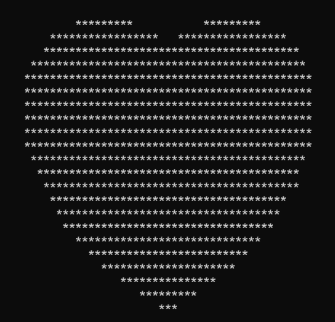

# 门昭霖的blog
### WELCOME TO MY BLOG
-----------------------------------------------------
*⭐🌙与其仰望星空，不如去做摘星星的人🌙⭐*

-----------------------------------------------------
## Myself

 

   >Name:门昭霖
   >
   >Gender:🚹  
   >
   >🎂:2004 Aug 12th
   >
   >Dream😶‍🌫️:🕵️👨‍🚀👨‍💻🦸‍♂️🧙‍♂️(~~我是个贪心的人~~)
   >
   >Like:🐱🐶🐿️🐇🦔
   >
   >MBIT:ENFP⚛️
   >
   >XMUM 2209 SWE STUDENT
   >
   >Interest:| Algorithm | AI | Game Design | Data Science |

Contect:
Email:SWE2209534@xmu.edu.my

-----------------------------------------------------
   ### Study Achievement
  |Language|
- [x] C/C++  
- [x] Java   
- [x] Python 
- [ ] HTML    
- [ ] JavaScript  
- [ ] Golang
- [ ] Rust 
  ## Study Plan
  For Framework


|  Framework | Status |
|    :--:    |    ----    |
| [Vue](https://vuejs.org/)    |---     |
|[React](https://vuejs.org/)       |        |
| [Angular](https://vuejs.org/)    |        |


```cpp
#include<iostream>
#include<cmath>
using namespace std;
int main()
{   
    float x, y;
    for (y = 1.5f; y > -1.5f; y -= 0.1f)
    {
        for (x = -1.5f; x < 1.5f; x += 0.05f)
        {
            float a = x * x + y * y - 1;
            if ((a * a * a - x * x * y * y * y) <= 0)
            {
                cout << "*";
            }
            else
            {
                cout << " ";
            }
        }
        cout << endl;
    }
    system("pause");
    return 0;
}
```


## More About Me
Waiting for you to explore 

